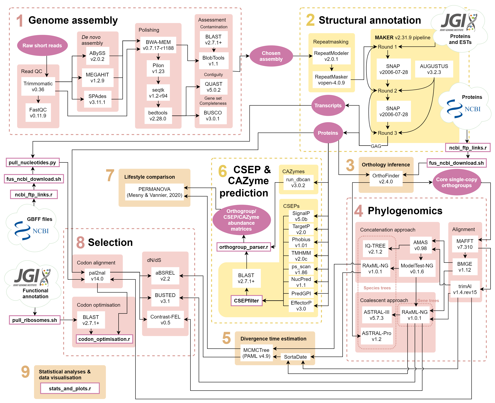

# *Fusarium* Lifestyles
 
Bioinformatics analysis pipeline for Hill et al. (in prep) Lifestyle transitions in fusarioid fungi are frequent and lack clear genomic signatures.

The pipeline was written for and run on Queen Mary University of London's [Apocrita HPC facility](http://doi.org/10.5281/zenodo.438045) which uses the Univa Grid Engine batch-queue system.
